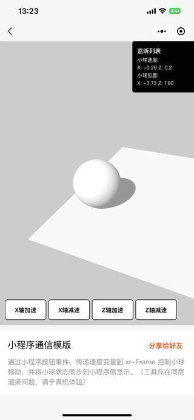
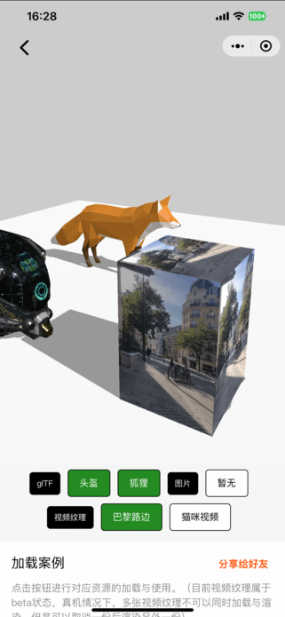
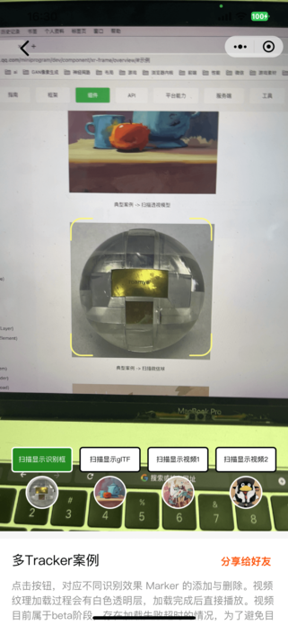
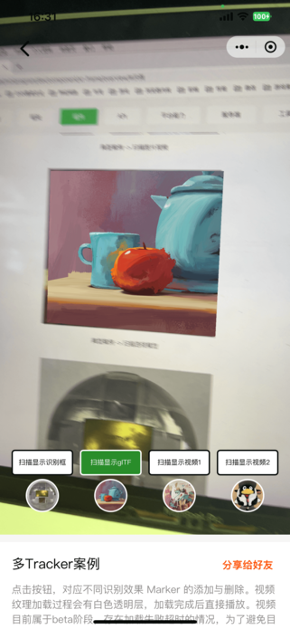

# 常见案例模版

| 模版名称  | 截图           | 描述         |
|----------|:-------------:|:-----------:|
|[通信案例](/miniprogram/pages/template/xr-template-message/) |  | 通过小程序按钮事件，传递速度变量到 xr-Frame 控制小球移动，并将小球状态同步到小程序侧显示。（工具存在同层渲染问题，请于真机体验） |
|[加载案例](/miniprogram/pages/template/xr-template-loading/) |  | 点击按钮进行对应资源的加载与使用。（目前视频纹理属于beta状态，真机情况下，多张视频纹理不可以同时加载与渲染，但是可以取消一份后渲染另外一份） |
|[多Tracker案例](/miniprogram/pages/template/xr-template-tracker/) |    | 点击按钮，对应不同识别效果 Marker 的添加与删除。视频纹理加载过程会有白色透明层，加载完成后直接播放。视频目前属于beta阶段，存在加载失败超时的情况，为了避免目前版本的Crash问题，每次扫描会重新拉取视频。 |